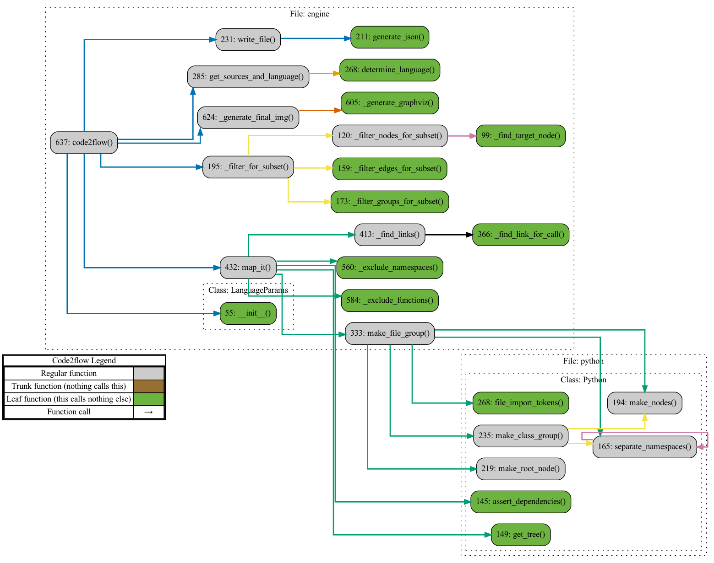

### Updates from April 2021
- I've entered into a contract with a generous sponsor to update code2flow. Expect a new version sometime in May of 2021.
- The new version will support Python3, ECMAScript 2018, PHP8, & Ruby3
- Most of the project will be rewritten and licensed under the MIT license. As always, existing code never changes license.
- The domain, code2flow.com is unrelated to this project and as far as I can tell through the internet archive, they launched their service after this repository was created. I've never heard anything from them and it doesn't appear like they use anything from here.
- The pip install, code2flow, has been claimed by a different unrelated project. For now, *don't install* code2flow from pip. Instead, scroll to the installation section for instructions.


   

Code2flow generates [call graphs](https://en.wikipedia.org/wiki/Call_graph) for your Python and Javascript projects. 

The algorithm is simple:

1. Find function definitions in your project's source code.
2. Determine where those functions are called.
3. Connect the dots. 

Code2flow is useful for:
- Untangling spaghetti code.
- Identifying orphaned functions
- Getting new developers up to speed.

Code2flow will provide a **pretty good estimate** of your project's structure. No algorithm can generate a perfect call graph for a [dynamic language](https://en.wikipedia.org/wiki/Dynamic_programming_language) - even less so if that language is [duck-typed](https://en.wikipedia.org/wiki/Duck_typing).

See the known limitations in the section below.

*code2flow running against itself*

TODO abspath https://raw.githubusercontent.com/scottrogowski/code2flow/master/assets/code2flow_output.png



Installation
------------

For now, do _not_ pip install (The code2flow name is held by a different project). Instead, run:

```bash
python setup.py install
```

If you don't have it already, you will also need to install graphviz. Installation instructions can be found [here](https://graphviz.org/download/).

Usage
-----

To generate a DOT file run something like:

```bash
code2flow mypythonfile.py
```

Or, for javascript

```bash
code2flow myjavascriptfile.js
```

You can also specify multiple files or import directories

```bash
code2flow project/directory/source_a.js project/directory/source_b.js
```

```bash
code2flow project/directory/*.js
```

```bash
code2flow project/directory --language js
```

There are a ton of command line options, to see them all, run

```bash
code2flow --help
```

How code2flow works
------------

Code2flow approximates the structure of projects in dynamic languages. It is not possible to generate a perfect callgraph for a dynamic language. Code2flow works by using regular expressions - not abstract syntax trees. This is a concious design choice. Regular expressions allow code2flow to utilize heuristics that are unavailable in strict ASTs. The end result is more connections and more accurate connections. 

Detailed algorithm:

1. Remove all comments and strings from the source.
2. Identify and isolate all groups. Groups are files, modules, or classes. More precisely, groups are namespaces where functions live.
3. From the groups, identify and isolate all function definitions. These are called "nodes" internally.
4. For each node, generate a series of regular expressions that represent all the ways it can be called in different namespaces.
5. Search each node for each other node's regular expressions. This is a O(n^2) operation. If a match is found, connect the two nodes. If there is an ambiguity (two matches of nodes with the same token), loudly identify that ambiguity and skip.
6. Trim orphaned nodes and groups.
7. Output results.


Known limitations
-----------------

Code2flow is internally powered by regular expressions. Most limitations stem from tokens not being named what the engine expects them to be named.

* All functions without definitions are skipped. This most often happens when a file is not included.
* Functions with identical names in different namespaces are (loudly) skipped. E.g. If you have two classes with identically named methods, code2flow cannot distinguish between these and skips them.
* Imported functions from outside of your project directory (including from the standard library) which share names with your defined functions may not be handled correctly. Instead when you call the imported function, code2flow will link to your local functions. E.g. if you have a function "search()" and call, "import searcher; searcher.search()", code2flow may link (incorrectly) to your defined function.
* Anonymous or generated functions are skipped. This includes lambdas and factories.
* If a function is renamed, either explicitly or by being passed around as a parameter, it will be skipped.


License
-----------------------------

Code2flow is licensed under the MIT license.
Prior to the rewrite in April 2021, code2flow was licensed under LGPL. The last commit under that license was 24b2cb854c6a872ba6e17409fbddb6659bf64d4c. 
The April 2021 rewrite was substantial so it's probably reasonable to treat code2flow as completely MIT-licensed.


Feedback / Bugs / Contact
-----------------------------

Please do email!
scottmrogowski@gmail.com


How to contribute
-----------------------

1. You can contribute code! Code2flow has limitations. Attempts to address these limitation would probably be helpful and accepted. Separately, new languages will be especially appreciated!

2. You can spread the word! A simple way to help is to share this project with others. If you have a blog, mention code2flow! Linking from relevant questions on StackOverflow or other forums also helps quite a bit.


Feature / Language Requests
----------------

Email me. I am an independent contractor and can be convinced to work on this for an appropriate amount of money.
